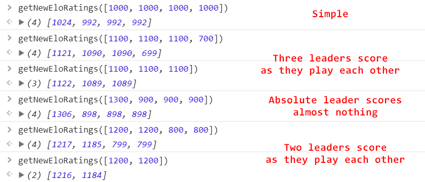
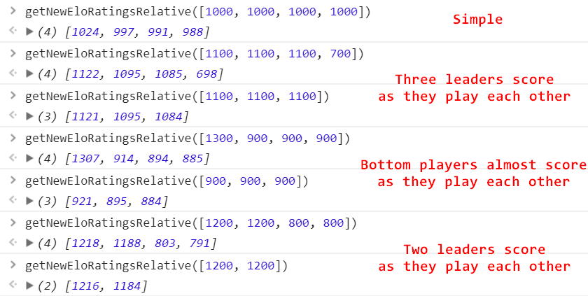

# elo-multiplayer
Elo rating system calculations implementation for multiple players.

**1. Basic extension for elo system.**

Idea: 

a)extend Ea = Qa / (Qa + Qb) formula to Ea = Qa / (Qa + Qb + ... + Qz). Ea + Eb + ... + Ez is still equals to 1.

b)Having expected probablitity of winning for PlayerA as Ea, rating change will be K * (result - Ea), where result is 1 if PlayerA is a winner and 0 otherwise.

  

**2. Extension with use of ranks.**

Idea: 

a)Sometimes being 2nd/3rd in the game matters.

b)Let's say that all players except winner were aware of the winner all along. So they could have their own competition over reward smaller comparing to K. Let's give them another adjustment.

c)On each iteration: 1)Let's replay the game without last winner. 2)newK (smaller reward) is K * Ewinner. 3)Iterate until last 2 players get adjusted.

  

